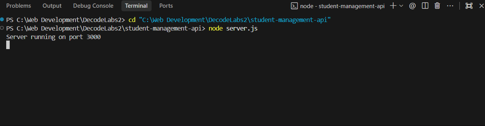
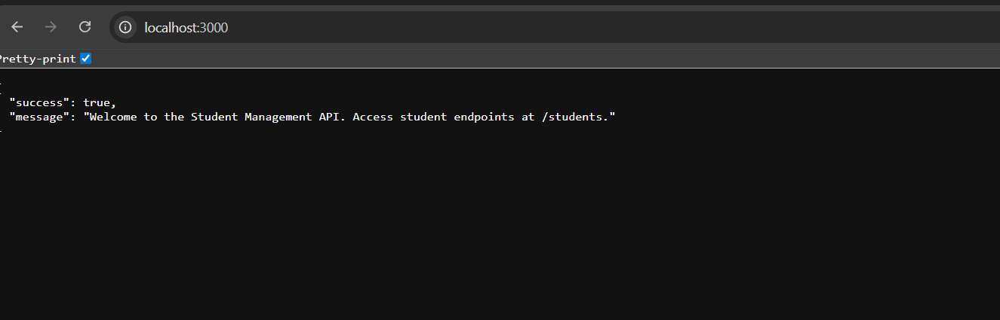
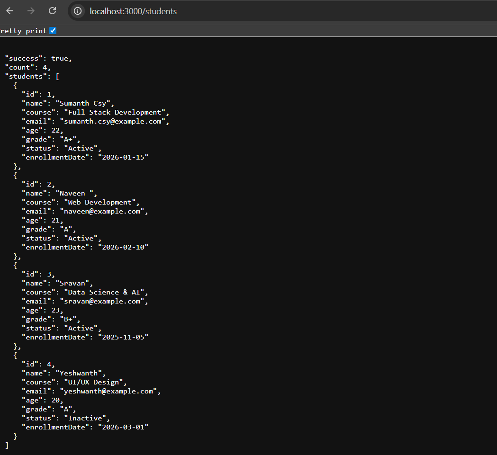
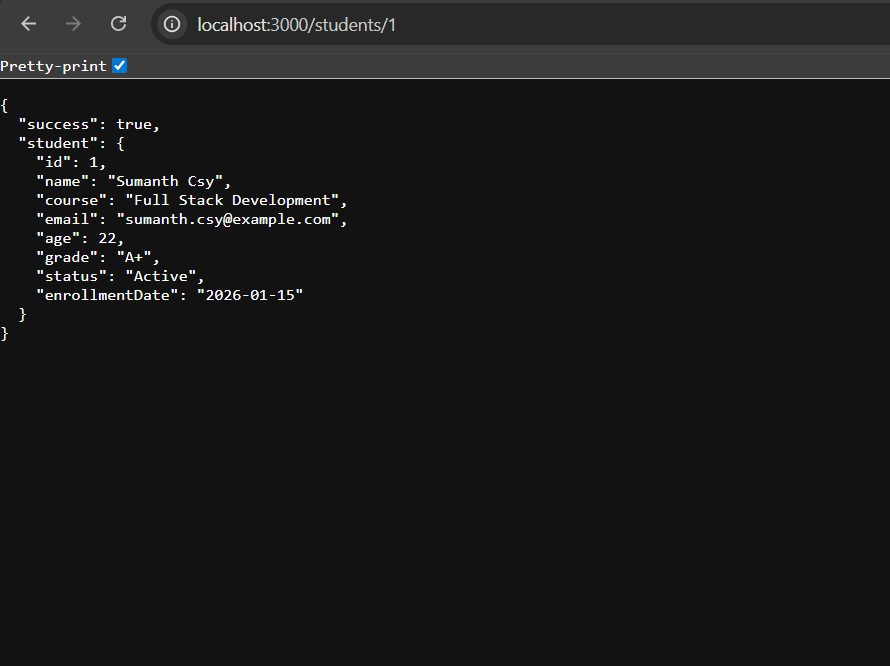
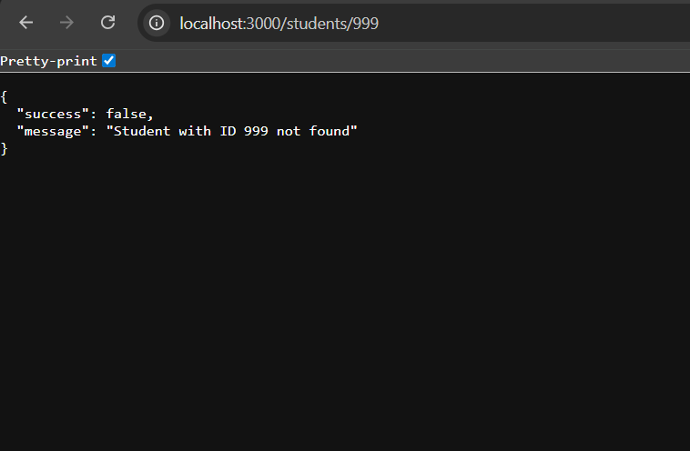
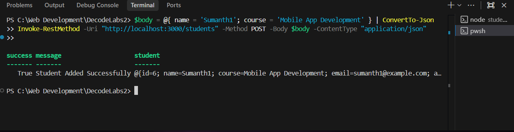

# Student Management API

A clean, light-weight, and professional Backend REST API developed using **Node.js** and **Express.js** for managing student profiles. This project is built without a database (using an in-memory data store) and is tailored for internship evaluations.

---

### 🌐 Test via URL in Web Browser (GET Requests)
You can click or open these links directly in your browser to view the JSON output:

- **Welcome Route**: [http://localhost:3000/](http://localhost:3000/)
- **Get All Students**: [http://localhost:3000/students](http://localhost:3000/students)
- **Get Student 1**: [http://localhost:3000/students/1](http://localhost:3000/students/1)
- **Test Student Not Found**: [http://localhost:3000/students/999](http://localhost:3000/students/999)

---

## Table of Contents

- [Project Introduction](#project-introduction)
- [Features](#features)
- [Folder Structure](#folder-structure)
- [Prerequisites](#prerequisites)
- [Installation Steps](#installation-steps)
- [Running the Application](#running-the-application)
- [API Endpoints Documentation](#api-endpoints-documentation)
  - [1. Welcome Route](#1-welcome-route)
  - [2. Get All Students](#2-get-all-students)
  - [3. Get Student by ID](#3-get-student-by-id)
  - [4. Add New Student](#4-add-new-student)
- [HTTP Status Codes Reference](#http-status-codes-reference)

---

## Project Introduction

The **Student Management API** is a backend system that provides essential endpoints to perform Create and Read operations on student records. The records are enriched with comprehensive attributes like email, age, academic grade, enrollment status, and registration date, demonstrating real-world API development practices.

The project features:
- **Modular Architecture**: Separate directories for routes, controllers, middleware, and data stores (MVC-like pattern).
- **In-Memory Storage**: Uses a mock stateful JS data array containing pre-seeded entries.
- **Request Validation**: An Express middleware intercepts validation criteria prior to routing.
- **Unified Error Handling**: Incorporates 404 route fallback and centralized server exception catchers.

---

## Features

- **Robust Validation**: Rejects requests lacking a `name` or `course`.
- **Intelligent ID Generation**: Automatically assigns incremental IDs based on current database state.
- **Default Formatting**: Automatically formats user emails, sets registration dates, and handles default grades/ages if left unspecified.
- **Consistent Responses**: Delivers standard JSON payloads across both success and failure cases.

---

## Folder Structure

Below is the clean and modular directory layout designed for this project:

```text
student-management-api/
│
├── server.js               # Entry point of the Express application
├── package.json            # Manifest file declaring dependencies and scripts
├── .gitignore              # Files and folders to ignore in Git
│
├── routes/
│   └── studentRoutes.js    # Routes mapping HTTP methods/URLs to controllers
│
├── controllers/
│   └── studentController.js# Business logic handling HTTP requests/responses
│
├── middleware/
│   └── validation.js       # Input validator for checking student fields
│
├── data/
│   └── students.js         # Mock in-memory database of students
│
└── README.md               # Project documentation (this file)
```

---

## Prerequisites

Before running the application, make sure you have the following installed on your system:
- **Node.js** (v14.x or higher recommended)
- **npm** (Node Package Manager, typically pre-bundled with Node)

---

## Installation Steps

Follow these steps to set up the project locally:

1. **Navigate to the Project Directory:**
   ```bash
   cd student-management-api
   ```

2. **Install Dependencies:**
   ```bash
   npm install
   ```
   This will install `express` and other configuration files listed in `package.json`.

---

## Running the Application

To run the application, execute:

```bash
node server.js
```

Upon successful startup, the following message will be printed in your terminal:
```text
Server running on port 3000
```

* **Terminal Output Screenshot:**
  

---

## API Endpoints Documentation

### 1. Welcome Route
Verify that the API is up and running.

* **URL:** `/`
* **Method:** `GET`
* **Response Status:** `200 OK`
* **Screenshot:**
  

* **Response Body:**
  ```json
  {
    "success": true,
    "message": "Welcome to the Student Management API. Access student endpoints at /students."
  }
  ```

---

### 2. Get All Students
Retrieve list of all registered students.

* **URL:** `/students`
* **Method:** `GET`
* **Response Status:** `200 OK`
* **Screenshot:**
  

* **Response Body:**
  ```json
  {
    "success": true,
    "count": 4,
    "students": [
      {
        "id": 1,
        "name": "Sumanth Csy",
        "course": "Full Stack Development",
        "email": "sumanth.csy@example.com",
        "age": 22,
        "grade": "A+",
        "status": "Active",
        "enrollmentDate": "2026-01-15"
      },
      {
        "id": 2,
        "name": "Naveen ",
        "course": "Web Development",
        "email": "naveen@example.com",
        "age": 21,
        "grade": "A",
        "status": "Active",
        "enrollmentDate": "2026-02-10"
      },
      {
        "id": 3,
        "name": "Sravan",
        "course": "Data Science & AI",
        "email": "sravan@example.com",
        "age": 23,
        "grade": "B+",
        "status": "Active",
        "enrollmentDate": "2025-11-05"
      },
      {
        "id": 4,
        "name": "Yeshwanth",
        "course": "UI/UX Design",
        "email": "yeshwanth@example.com",
        "age": 20,
        "grade": "A",
        "status": "Inactive",
        "enrollmentDate": "2026-03-01"
      }
    ]
  }
  ```

---

### 3. Get Student by ID
Retrieve details of a single student matching the provided ID.

* **URL:** `/students/:id`
* **Method:** `GET`
* **URL Params:** `id=[integer]`

#### Success Response
* **Response Status:** `200 OK`
* **Screenshot:**
  

* **Response Body:**
  ```json
  {
    "success": true,
    "student": {
      "id": 1,
      "name": "Sumanth Csy",
      "course": "Full Stack Development",
      "email": "sumanth.csy@example.com",
      "age": 22,
      "grade": "A+",
      "status": "Active",
      "enrollmentDate": "2026-01-15"
    }
  }
  ```

#### Error Response (Student Not Found)
* **Response Status:** `404 Not Found`
* **Screenshot:**
  

* **Response Body:**
  ```json
  {
    "success": false,
    "message": "Student with ID 999 not found"
  }
  ```

#### Error Response (Invalid ID Format)
* **Response Status:** `400 Bad Request`
* **Response Body:**
  ```json
  {
    "success": false,
    "message": "Invalid Student ID format. Must be an integer."
  }
  ```

---

### 4. Add New Student
Create a new student entry.

* **URL:** `/students`
* **Method:** `POST`
* **Headers:** `Content-Type: application/json`

#### Sample Request 1: Providing Minimum Required Fields (Valid)
* **Request Body:**
  ```json
  {
    "name": "Sumanth1",
    "course": "Mobile App Development"
  }
  ```
* **Response Status:** `201 Created`
* **Screenshot:**
  

* **Response Body:**
  ```json
  {
    "success": true,
    "message": "Student Added Successfully",
    "student": {
      "id": 5,
      "name": "Sumanth1",
      "course": "Mobile App Development",
      "email": "Sumanth1@example.com",
      "age": 21,
      "grade": "A",
      "status": "Active",
      "enrollmentDate": "2026-06-07"
    }
  }
  ```

#### Sample Request 3: Missing Required Fields (Invalid)
* **Request Body:**
  ```json
  {
    "name": "Invalid Student"
  }
  ```
* **Response Status:** `400 Bad Request`
* **Response Body:**
  ```json
  {
    "success": false,
    "message": "Name and Course are required"
  }
  ```

---

## HTTP Status Codes Reference

The API uses proper HTTP response codes to denote the state of requests:

| Code | Meaning | Description |
|---|---|---|
| **`200`** | **Success** | Request resolved successfully. |
| **`201`** | **Created** | Resources successfully created. |
| **`400`** | **Bad Request** | Payload validation failed or bad parameters. |
| **`404`** | **Not Found** | Student record or endpoint route does not exist. |
| **`500`** | **Internal Server Error** | Unexpected error on server side. |


> **By @Sumanth Csy**
